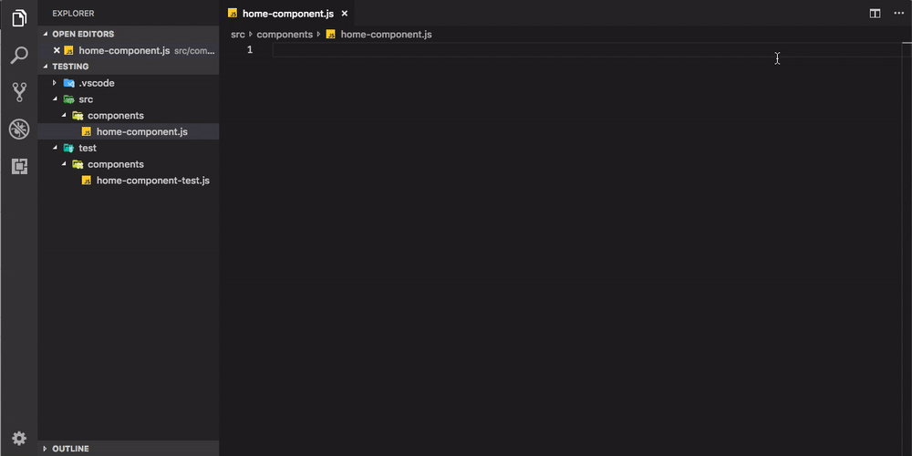

# test-file-finder README



This extension is useful for quickly finding and opening test files.
The current keybinding is Ctrl + F1 on Windows or Cmd + F1 on Mac, but I am taking suggestions for what would be better.

Add the extension via the [VS Code marketplace](https://marketplace.visualstudio.com/items?itemName=riegledevin.test-file-finder), or from the extensions pane in VS Code itself.

## Current configuration:

| Name | Default | Description
| -- | -- | -- |
| `testFinder.showInStatusBar` | `false` | Shows a message on the left side of the status  bar to indicate whether it has found the test file or not
| `testFinder.openInSplitView` | `true` | Open test file in split view or current window
| `testFinder.csharpGlob` | `Tests.cs` | Default for C# files (ex: Foo.cs has test file FooTests.cs)
| `testFinder.javascriptGlob` | `-test.js` | Default for JavaScript files (ex: foo.js has test file foo-test.js)
| `testFinder.rubyGlob` | `_spec.rb` | Default for Ruby files (ex: foo.rb has test foo_spec.rb)
| `testFinder.typescriptGlob` | `-test.ts` | Default for Typescript files (ex: MyUtil.ts has test MyUtil-test.ts)
| `testFinder.typescriptreactGlob` | `-test.ts` | Default for TSX files (ex: MyComponent.tsx has test MyComponent-test.ts)


## Adding support for new test files
You can add support for new test files by adding your configuration to the `package.json` file like so:

```json
"contributes" {
  "configuration": {
    "title": "Test File Finder Configuration",
    "properties": {
      "testFinder.<languageId>Glob": {
        "type": "string",
        "default": "<append-to-file-name>",
        "description": "..."
      }
    }
  }
}
```

You also need to update `activationEvents` for the language you're adding so the extension will start when a file for that language is open:

```json
"activationEvents": [
        "onLanguage:<supported-languageId-value>",
    ]
```

You can find the supported languageId values [here](https://code.visualstudio.com/docs/languages/identifiers).
